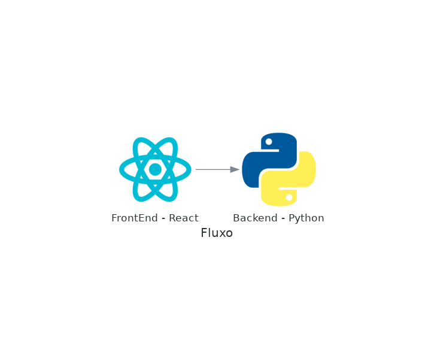

# Conversão de valores

Projeto que converte real para outras moedas.

## 1 - Fluxo



## 2 - Teste de conversão

### 2.1 - Teste com valor aleatorio:

```
curl http://localhost:5000/converter?valor_orig=$(echo $RANDOM)
```

### 2.2 - Exibindo as métricas

```
curl http://localhost:5000/metrics
```

## Run

Execute o projeto com o comando:

```bash
docker compose up
```